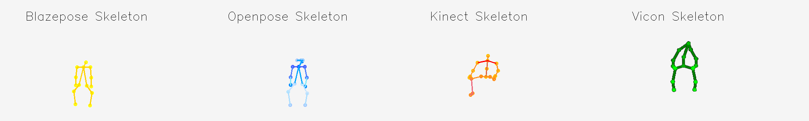
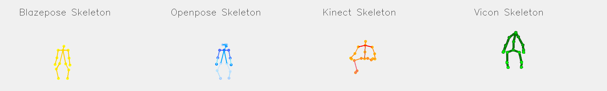
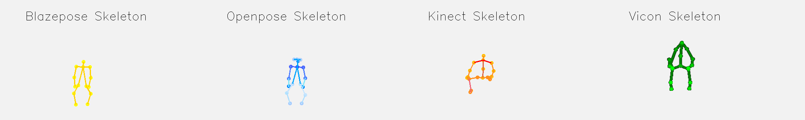
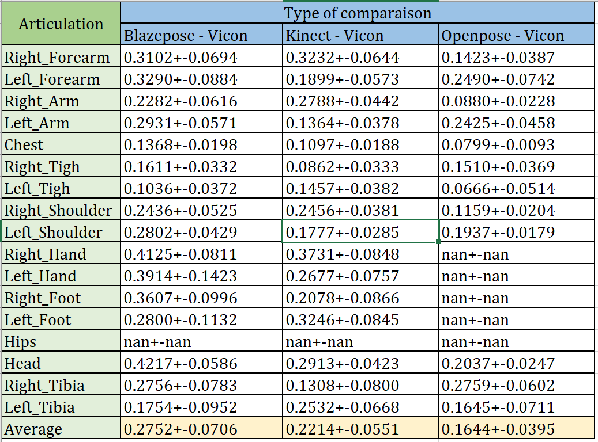
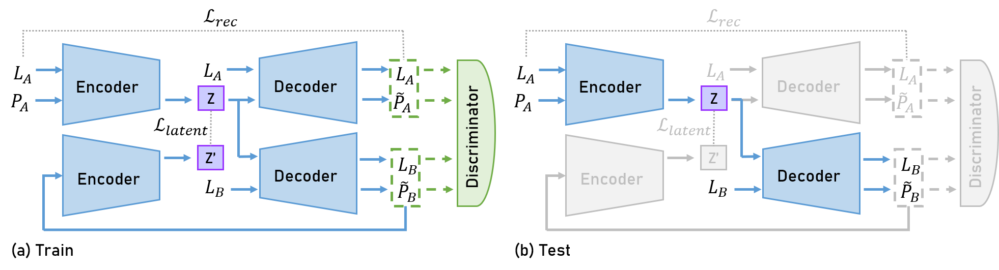
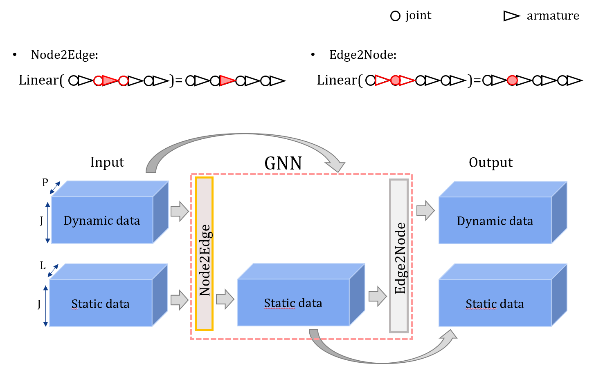
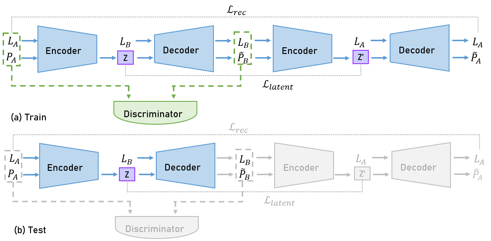
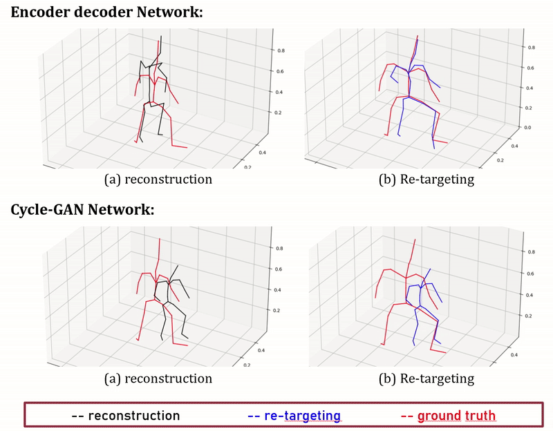
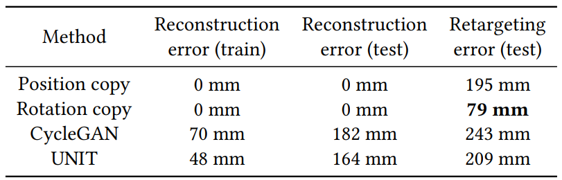

## Introduction

The Keraal project aims to develop a physiotherapist robot called Poppy capable of “coaching” patients during their rehabilitation sessions. Our work is a part of the Keraal project to improve the capability of the Poppy robot. The objective of our work is to detect and imitate human movements by the Poppy robot. Firstly, we try the Blazepose library to detect human skeletons in the collected videos, and we compare the results with those made by the Kinect, Openpose and Vicon library and calculate the differences. We choose the Kinect library as the most suitable library for imitation work. After obtaining the human motions, we build a learning model to apply motion retargeting between two characters. We test the model on animation data from Mixamo, then analyze the performance and propose a method to improve. 

## Movement detection and comparison
We detect three movements: head cover, side stretch and trunk rotation by using Blazepose, Openpose, Kinect and Vicon. Some visulization results is shown in Fig.1- Fig.3. Then, we consider the position detected by Vicon as ground truth and compare the method Blazepose, Openpose and Kinect with Vicon, the results are shown in Tab. 1.

  
   
  <em>Figure 1: Visulisation of Movement head cover detected by Blazepose, Openpose, Kinect and Vicon </em>

  
   
  <em>Figure 2: Visulisation of Movement side stretch detected by Blazepose, Openpose, Kinect and Vicon  </em>

  
   
  <em>Figure 3: Visulisation of Movement trunk rotation detected by Blazepose, Openpose, Kinect and Vicon  </em>

  
   
  <em>Table 1: The comparison of error between Blazepose-Vicon, Openpose-Vicon and Kinect-Vicon  </em>

Accoding to the table, since the average error of Kinect is smaller than that of Blazepose, we believe that kinect performs better.

## Unsupervised Motion Retargeting for Human-Robot Imitation
### Method
we describe the retargeting algorithm. As depicted in Fig. 4, the algorithm consists of a pair of encoder-decoder
to extract the main characteristics of a motion and to generate a
motion in the target joint position space, and a discriminator to
challenge the decoder.

  
   
  <em>Figure 4: Algorithm architecture with an encoder-decoder
and a discriminator </em>

The encoder takes as input $x^A$, a sequence of joint positions in the domain of motions performed by a performer $A$. It infers a latent variable $𝑧$ from this input motion, disentangling information about the motion itself from the information about the performer, as represented in the Figure 5. Then the decoder takes as input this latent variable $𝑧$ as well as the lengths of the performer $B$ bones, that we denote $l^B$, and outputs a prediction $x^B$ corresponding to the motion translated to the domain of motions performed by the performer B.

  
   
  <em>Figure 5: Details of the encoder-decoder </em>

The encoder and the decoder both comprise three layers of graph convolutions mixed with three layers of temporal 1D convolutions.
The graph convolutions allow to process information on the skeleton dimension, while the temporal convolutions allow to process information on the temporal dimension. The discriminator takes as input a predicted motion and target performer bone lengths and outputs a real number scoring how well the predicted motion fits the distribution of target motions. It is trained with adversarial training, using positive real samples from the distribution and fake samples generated by the encoderdecoder network. Its structure is similar to the encoder, with an additional dense layer at the end to output the score. It combines temporal 1D convolutions and two-steps graph convolutions to include the bone lengths in the processing.

### Training
We train the encoder-decoder network and compare it to a Cycle-GAN network which has a structure as Fig. 6.

  
   
  <em>Figure 6: Algorithm architecture with an Cycle-GAN
and a discriminator </em>

We train our models on a dataset of animated motions called [Mixamo](https://www.mixamo.com/). This dataset advantageously contains the same motions performed by different animated characters. We create a training and testing set from motions exported from the website, with 800 motions distributed among 25 characters for the training set (unpaired data), and 110 same motions for 4 other characters in the test set. The Mixamo dataset comprise fbx files, a type of 3D model file containing mesh, material, texture, and skeletal animation data,
which can be easily 3d joint positions. With this separation, we ensure that the training data do not contain any motion performed by two different characters, and on the contrary, that testing data contain corresponding motions for different characters, which allows us to compute a prediction error.

### Results

  
   
  <em>Figure 7: Performance of Encoder-decoder compared with Cycle-GAN</em>

We present here early results and visulise them in Fig. 7. We measure the average retargeting prediction error on the test set using the two methods described above, and compare them with two simple baselines consisting respectively in copying the source joint positions, and copying the source joint orientations (and computing the joint positions using the target skeleton bone lengths). The results are displayed in Tab. 2.

  
   
  <em>Table 2: Comparison of the different retargeting methods </em>

The results argue so far against our initial hypothesis that deep
learning methods can successfully perform unpaired motion retargeting, as a simple method copying joint orientations (rotation copy in the table) can better retarget motions. More experiments will be conducted in order to properly identify the causes of this failure.

> This part is accepted by a HRI workshop, see the [article](https://arxiv.org/abs/2402.05115), [code](https://github.com/ZiqiLoveSunshine/Unsupervised-Motion-Retargeting-for-Human-Robot-Imitation), and the [poster](http://ZiqiLoveSunshine.github.io/files/Poster.pdf) for details.

## Video Presentation
<figure class="video_container">
  <video controls="true" allowfullscreen="true" poster="../images/2022Keraal/video.png">
    <source src="../files/Trailer_ProjetKERAAL_STF.mp4" type="video/mp4">
  </video>
</figure>

## Files download
You can download the [report](http://ZiqiLoveSunshine.github.io/files/PRe.pdf) of this project of this project.

