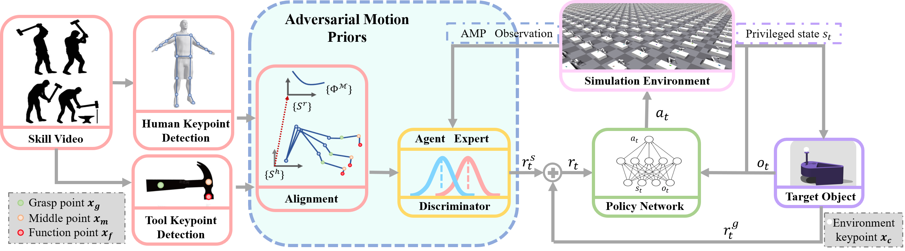
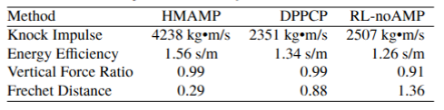
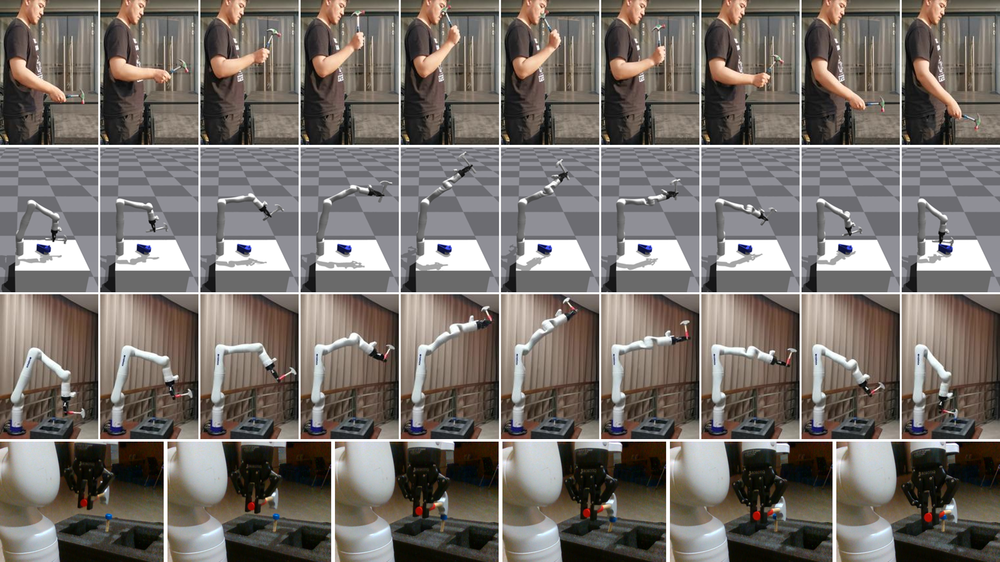

In recent years, there has been growing interest in developing robots and autonomous systems that can interact with humans in a more natural and intuitive way. One of the key challenges in achieving this goal is to enable these systems to manipulate objects and tools in a manner that is similar to how humans do. In this paper, we propose a novel approach for learning human-style manipulation skills by using adversarial motion priors. Our approach leverages a deep neural network to model the complex dynamics of tool and object manipulation. The network is trained using a combination of real-world data and synthetic data generated by an adversarial network. The adversarial network is designed to generate realistic motion trajectories that match the statistical properties of human motion, which are then used to augment the training data for the manipulation network. We evaluate our approach on a manipulation task: hammering. Our results demonstrate that our approach is able to learn human-style manipulation skills that outperform state-of-the-art methods. Additionally, we show that our approach is able to generalize to novel objects and tasks, demonstrating its potential for real-world applications.

## Methods

  

  Figure 1: The overall structure of HMAMP. With human manipulation video clips, we extract the keypoints of the human arm and manipulation tools. 
  Then we perform keypoint alignment between the robot arm in simulation and real-world human motion clips. 
  The AMP Discriminator is used to distinguish whether an action sequence is a real human expert motion or generated by the policy network. 
  The AMP reward and the task reward for manipulation are combined to form the total reward for RL training.

In order to teach a robot to learn human manipulation skills in a more natural and intuitive way, we combine Adversarial Motion Priors (AMP) within a reinforcement learning problem. [AMP](https://arxiv.org/abs/2104.02180) is a cutting-edge approach first appearing in computer graphics, it uses an adversarial network to learn a "style" with a reference motion dataset. The reward function involves a style reward that encourages the agent to replicate similar trajectories to those in the dataset and a task reward that assesses whether the agent achieves the task while mimicking the motion style. We also adapt style and task rewards to teach a robot arm human-like tool manipulation skills using demonstration video clips. Our approach involves competitive training between a policy network and an adversarial network. The policy network is trained using both task-specific and adversarial rewards to generate a policy that accomplishes the task with human style. The adversarial network acts as a discriminator, determining the origin of state transitions and providing a reward that effectively motivates the training of an agent. Due to the use of adversarial motion prior in guiding the robot to learn human-like manipulation skills, we name the method HMAMP. 

### Rewards Design
The total reward $r_t$ is determined as a goal reward $r^g_t$, which is specific to the task, helps to describe the completion of task, and a style reward $r^s_t$ that evaluates whether the behaviors produced by the agent is similar to the behaviors produced via the distribution of reference motion set. The more similar the behaviors are, the higher value the style reward is. The proportion between style reward and goal reward is adjusted manually before training.
$$
r_t = \alpha^g r^g_t + \beta^s r^s_t
$$

#### Goal Reward about Task
For the tool manipulation tasks where there is a contact with environment, we design the goal reward $r^g_t$ composed by two terms at one instance $t$.

$$
\begin{aligned}
r^g_t &= \omega^f r^f_t + \omega^d r^d_t \\
r^f_t &= \left\{
    \begin{array}{rcl}
    \lVert F^{s}_t(\boldsymbol{x}_f,\boldsymbol{x}_c)\rVert /F^d
     & & {F^{s}_t \leq F^d} \\
    1 \quad \quad \quad \quad & & {F^{s}_t > F^d}
    \end{array}\right. \\
r^d_t &= 1- \tanh{(\left\lVert \boldsymbol{x}_f - \boldsymbol{x}_c\rVert _t\right)}
\end{aligned}
$$

The first term $r_t^f$ stimulates task completion, which is defined with the contact force detected on the target object that is exerted by the tool, the force is captured by force sensor in the simulation. The detected force is encouraged to converge towards the force $F_d$ that we desire. This reward has values only when contact occurs and after the detection of contact force, the policy terminates. The second term $r_t^d$ is defined between tool function point $\boldsymbol{x}_f$ and environment target point $\boldsymbol{x}_c$ to guide to exploit a policy that minimizes the distance between tool and target. The utilise of $\tanh$ function aims to bound the reward to $[0, 1]$. These terms are weighted with manually-specified coefficients $\omega^f$ and $\omega^d$, however, the magnitude of second term is much lower than the first.

#### Style Reward with Motion Prior
We define a discriminator $D_{\phi}$ as a neural network with parameter $\phi$, the discriminator is trained to distinguish whether a transition $(s, s')$ is a fake one produced by an agent or a true one sampled from a real motion distribution $d^\mathcal{M}$.

We update the objective of discriminator as: 

$$
\begin{aligned}
    \underset{\phi}{\operatorname{arg min}}\quad &\mathbb{E}_{d^\mathcal{M}(s,s')}\left[\left(D_{\phi}(s,s')-1\right)^2\right] \\+&\mathbb{E}_{d^\pi(s,s')}\left[\left(D_{\phi}\left(s,s'\right)+1\right)^2\right] \\
    +&\dfrac{w^{gp}}{2}
    \mathbb{E}_{d^\mathcal{M}(s,s')} \left[\lVert\nabla_{\phi}D_{\phi}\left(s,s'\right)\rVert^2\right]
\end{aligned}
$$

The former two terms serve to motivate the discriminator to differentiate between the input state derived from a policy and the input state derived from the reference motion data. The last term is a gradient penalty term to penalize nonzero gradients on samples, which may avoid oscillations and improve training stability. The $w^{gp}$ in the formula is a coefficient adjusted manually. 

The style reward is then defined by:
$$
r^s_t = \max\left[0, 1-\gamma^d (D_{\phi}(s,s')-1)^2 \right]
$$

with the additional offset and scale, the style reward is bounded between $[0, 1]$.

## Experiment Result
We compare HMAMP against the following baseline methods:
- Direct Path-Planning Control Policy (DPPCP): This baseline approach determines manipulation actions using predefined path-planning strategies. In this method, proportional-derivative (PD) control is employed to generate a planned trajectory guiding the hammer from its initial position to the nail.
- Reinforcement Learning without AMP (RL-noAMP): This baseline approach uses a standard reinforcement learning method for the agent to acquire manipulation skills. The configuration of this approach is identical to that of HMAMP, except that the adversarial motion priors (AMP) component is removed. The training process follows the same procedure as in HMAMP.

To quantitatively evaluate the performance of each approach, we define the following criterias:
- **Knock Impulse**: A measure of the knock effect received by the nail. It is calculated by the formula : $I = \int F_{nail}(t) \, dt$. Large Impulse means the nail receives large force at one instance.
- **Energy Efficiency**:  The energy used by the arm is $E = \sum_{i=1}^{n} \int \tau_i(t) \cdot \omega_i(t) \, dt$, where $n$ is the joint number of the arm. The energy efficiency can be represented as the ratio of knock impulse received by the nail and the energy cost by the arm: $\eta = I/E$
- **Vertical Force Ratio**: The vertical force ratio reflects how efficiently the force is applied in the vertical direction, which is critical for tasks involving hammering. Higher ratios indicate more effective and efficient nail hammering: $\text{Vertical Force Ratio} = \frac{F_{\text{vertical, nail}}}{F_{\text{total, nail}}}$
- **Frechet Distance**: The quantitative analysis in motion similarity between human and robot arm manipulation. The smaller the Frechet distance between two trajectories is, the more similar their shapes are.

  
   
  <em>Table 1: Comparison of HMAMP with baselines </em>

Tab. 1 presents the results, highlighting key performance metrics. The HMAMP consistently outperforms both DPPCP and RL-noAMP in all evaluated aspects. Notably, it has an overwhelming advantage in the impulse received by the nail, which is the most critical task of hammering nails. From the table we can also obtains that the HMAMP is more efficient in hammering, since both the energy efficiency and vertical force ratio excel the other methods. In addition, HMAMP has the closest Frechet Distance to human manipulation trajectories, which reflects the effectiveness of our method in learning human motion styles.

The experiment in real world is shown in Fig. 2.

  

  Figure 2: Real robot arm experiment. The first row shows human knocking motion clips that we used as motion priors. 
  The second row shows the policy HMAMP in simulation, where the hammer successfully completes the task with the desired manipulation trajectory. 
  The third row shows HMAMP implemented in the real world, using a Kinova Gen3 as the carrier. 
  The fourth row presents details of hammering a nail in the real robot arm experiments.

## Videos

<figure class="video_container">
  <video controls="true" allowfullscreen="true" poster="../images/2023Manipulate/ziqi_video_front.jpg" width = 500>
    <source src="../files/ziqi_video.mp4" type="video/mp4">
  </video>
</figure>

## Article and Code

See the article: [Manipulate as Human: Learning Task-oriented Manipulation Skills by Adversarial Motion Priors](../files/manipulate-as-human-learning-task-oriented-manipulation-skills-by-adversarial-motion-priors.pdf) and see the [code](https://github.com/ZiqiLoveSunshine/Manipulate_as_Human-AMP).