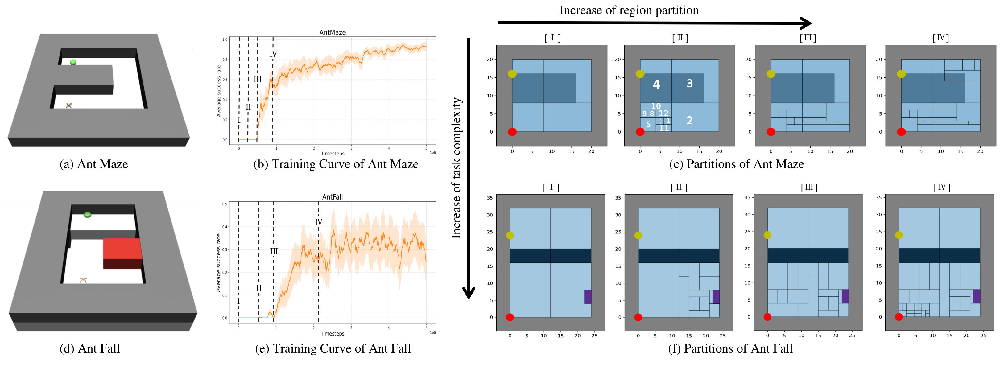

## Introduction

Emergent symbolic representations are critical for enabling developmental learning agents to plan and generalize across tasks. In this work, we investigate whether large language models (LLMs) can translate human natural language instructions into the internal symbolic representations that emerge during hierarchical reinforcement learning. We apply a structured evaluation framework to measure the translation performance of commonly seen LLMs – GPT, Claude, Deepseek and Grok – across different internal symbolic partitions generated by a hierarchical reinforcement learning algorithm in the Ant Maze and Ant Fall environments. Our findings reveal that **although LLMs demonstrate some ability to translate natural language into a symbolic representation of the environment dynamics, their performance is highly sensitive to partition granularity and task complexity.** The results expose limitations in current LLMs capacity for representation alignment, highlighting the need for further research on robust alignment between language and internal agent representations.

## Preliminary: Spatio-Temporal Abstraction via Reachability (STAR)

The [STAR algorithm](https://inria.hal.science/hal-04629549/document) is a reinforcement learning algorithm that uses a three-layered hierarchical structure: 

* Commander: the top-level agent plans the long-horizon path by setting intermediate goals. It is trained by Q-learning which chooses an abstract goal $G \in \mathcal{G}$ every $k$ steps that should help to reach the task goal $g^*$ from the current agent’s state $(G_{t+k} \sim \pi_{Comm} (s_t, g^*))$. 

* Tutor: the mid-level agent trained by TD3 which picks subgoals in the state space every $l$ steps $(g_{t+l} \sim \pi_{Tut}\left(s_t,G_{t+k}\right))$. We note that $k$ is a multiple of $l$.

* Controller: the low-level policy trained by TD3 that chooses actions to reach the subgoal every step $(a \sim \pi_{Cont}(s_t,g_{t+l}))$

STAR incrementally refines the partition of the sensorimotor space (as shown in Fig. \ref{fig:partitions_antmaze_antfall} (c)) by analyzing \(k\)-step reachability relations between goal regions. The refinement module uses as inputs the past episodes $\mathcal{D}$ and the list of abstract goals $\mathcal{E}$ visited during the last episode, and outputs a partition of the state space.

## Collecting of Representation

  

  Figure 1: (a)(d) Environments, (b)(e) Average success rate of STAR, (c)(f) Partition into regions of STAR, in respectively Ant Maze and Ant Fall. 
  The regions in (c)(f) are the internal representation emerging during the training at timestamps noted in (b) and (e). 
  The red point represents the initial position of the robot while the yellow point represents the goal position. 
  Our LLM-based system translates instructions to guide the robot (such as "go east to the end, turn north until past the wall and go west until the end"), into a sequence of traversed regions (for Partition II of AntMaze, the output is 5 → 11 → 2 → 3 → 4).

We collect the symbolic partitions that emerge during the execution of the STAR algorithm on the Ant Maze and Ant Fall, as illustrated in Fig. 1(a). To analyze LLM performance across different levels of abstraction, we select four representative partitions from different developmental learning stages, as shown in Fig. 1(c). Their corresponding positions are also marked along the training curves in Fig. 1(b). Partition I corresponds to the initialization partition with a minimal number of symbols; Partition II captures a timestep before any significant learning progress; Partition III aligns with the onset of performance improvement;  Partition IV represents the final stage of learning. 

## Experiment Evaluation
### Translation Ability

In the first experiment, we evaluate the consistency of LLMs in interpreting fixed natural language instructions across varying symbolic abstractions. For both the Ant Maze and Ant Fall environments, we keep the agent's start and goal positions fixed and apply the same instruction to all partition levels. The natural language instruction is: “Move right until you completely pass the wall on your left, move up until you have crossed the upper wall, turn left and proceed until you reach the goal”, the LLM needs to translate it into a sequence of traversed regions like 5 → 11 → 2 → 3 → 4 in Partition II. We use G-BLEU score to measure the matching degree of the sequence translate by LLM and the ground truth that is decided by human experts. We report in Tab. 1 the G-BLEU score for the translation results.

  
   
  <em>Table 1: Mean G-BLEU scores of LLMs over 4 runs for each partition in the Ant Maze and Ant Fall environments.
 </em>

While GPT o3-mini achieves the highest scores, all translators achieve scores above 0.5 across tasks, indicating a generally successful translation of human instructions into the agent’s internal symbolic representation. In the Ant Maze environment, all translator scores decrease as the number of regions increases. This observation suggests that as the symbolic space becomes more fine-grained, the increase in abstraction complexity challenges the LLMs’ ability to produce coherent and accurate language-to-symbol translation. In Ant Fall, however, the translation performance follows a non-monotonic trend—initially decreasing and then partially recovering. This pattern is likely due to the task’s increased complexity, which involves not only spatial navigation but also object manipulation. 

Notably, the degradation of performance varies for each model: GPT o3-mini and GROK demonstrate greater robustness than DeepSeek and Claude. Given the consistent trends observed across LLMs, we select GPT o3-mini as the representative LLM for subsequent experiments.

For more results, please see the [paper](../files/LLM_on_emergent_agency_CEUR_Workshop.pdf) and the [code](https://github.com/ZiqiLoveSunshine/ROMAN-workshop-2025)

