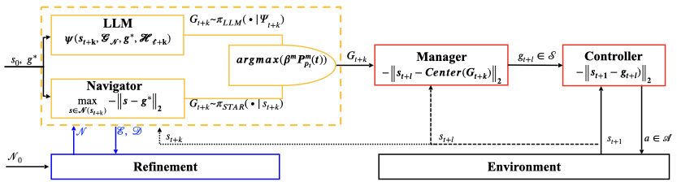
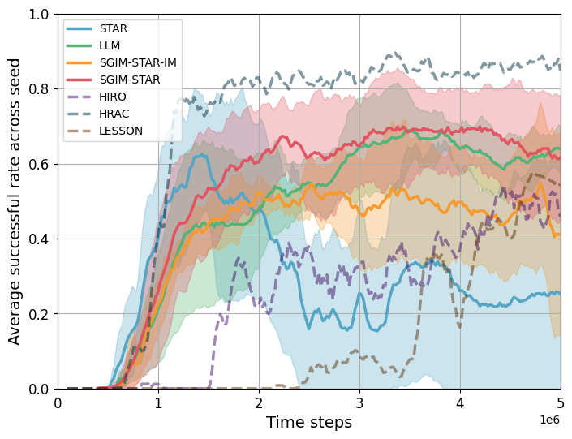

Large Language Models (LLMs) exhibit their potential for interacting with reinforcement learning agents, the main challenge is to align the world model learned by the agent with a representation compatible with LLMs, these representations should be well structured and contain the whole information of the environment. Some hierarchical reinforcement learning (HRL) addresses this challenge by decomposing task and producing emergent symbolic representations of a long-horizon task. However, a central open question  remains: how to effectively learn a representation of the environment that aligns with LLM? We study in this paper, how a symbolic representation of space can be taken advantage of by LLMs for learning long-horizon tasks. First, we evaluate the translation ability of the state-of-the-art LLMs in symbolic representation of emergent learning agent in Ant Maze task, showing that they succeed under coarse symbolic partitions however degrade with finer granularity. Inspired by this observation, we introduce SGIM-STAR, a hybrid framework where the top-level agent choose actively between a Q-learning based Commander and an LLM-based planner using a partition-wise, progress-driven intrinsic rule. Both strategies in this framework use a symbolic representation of the space. Experiments demonstrate that SGIM-STAR improves stability over STAR, reduces reliance on costly LLM calls, and achieves higher long-horizon task success.
Our findings highlight the dual role of LLMs as both translators of human intent and adaptive planners grounded in emergent symbolic representations, paving the way for more interpretable and language-grounded robotic planning.

## SGIM-STAR: Combining LLM and RL as Planners
Motivated by the finding in the [article](../files/LLM_on_emergent_agency_CEUR_Workshop.pdf) that LLM can be leveraged to translate human language to the symbolic representation emerging during RL agents, we investigate whether LLMs can be involved directly into the RL process for deeper improvements. We propose a method that integrates LLM as adaptive partners in planning. Our algorithm follows STAR’s hierarchical structure and reachability-aware abstraction, but augments the top-level agent with an LLM and introduces a partition-wise, progress-driven active learning between a  (Q-learning) RL-based planner and an LLM planner.

  

  Figure 1: Algorithmic architecture of SGIM-STAR which integrates the LLM and the Commander of STAR at the top-level agent and chooses between the LLM and the Commander based on progress. The Commander or the LLM selects subgoal regions, while the middle-level tutor and low-level controller are unchanged.

### Integration of an LLM into the Top Level Agent

We extend STAR by incorporating an LLM into the top-level agent. The structure is shown in Fig. 1. Instead of relying solely on the Commander policy $\pi_{Comm}(G|s_t)$, we introduce an LLM-based planner $\pi_{LLM}(G|\Psi_t)$, which operates on a prompt $\Psi_t$ encoding the agent’s current region, available partitions, and task description. Thus, the top-level goal selection becomes:
$$
\begin{align*}
G'_{t+k} \sim \pi_{LLM}(\cdot \,|\, \Psi_t),& \quad 
\Psi_t = \psi(s_t, \mathcal{G}_N, g^\ast, \mathcal{H}_t),
\end{align*}
$$
where $\mathcal{G}_N$ is the set of admissible regions, $g^\ast$ is the task goal, and $\mathcal{H}_t$ summarizes human knowledge. This modification allows the top-level agent to integrate human-readable instructions and world knowledge expressed in natural language, thereby aligning regional exploration with external guidance or commonsense priors. 

### Active Imitation Learning of the Top Level Agent
To dynamically balance between the original STAR Commander and the LLM-based planner, we use intrinsic motivation based on progress measure as a selection mechanism.

**Initialization.** For the first $N$ decision steps, the planner is chosen randomly between the STAR Commander and LLM in order to populate both buffers with initial experience.

**Progress signal.** At each timestep $t$, let $m \in \mathcal{M}=\{STAR, LLM\}$ denote the planner used, known that $\mathcal{G}_t$ is the partition of the space that has the same update mechanism as STAR, let $g_t = \phi(s_t, \mathcal{G}_t)$ be the current region where agent's current state belongs to in the partition $\mathcal{G}$. We define the incremental reward difference:
$
\Delta_t = r_t - r_{t-1}
$
which reflects the immediate progress attributable to the planner’s decision at $t$. This value $\Delta_t$ is stored as $\Delta_t^{(m)}$ in the buffer of the corresponding planner $m$ for the active region $g_t$.  

**Discounted progress accumulation.**
For each region $g_t$ and planner $m$, we compute a discounted cumulative progress over a sliding window of length $n$:
$$
\begin{align*}
\mathcal{P}_{g_t}^{(m)}(t) &= \sum_{j=0}^{n} \alpha^{\,j}\, \Delta_{t-j}^{(m)}
\end{align*}
$$
where $\alpha \in (0,1)$ is a progress discount factor that emphasizes recent progress while retaining memory of past improvements.  

**Planner selection rule.**
At each decision step, the algorithm selects the planner according to a progress-maximization criterion:
$$
\begin{align*}
    m &= \underset{m \in \mathcal{M}}{\arg\max}\left\{\beta^{(m)} \mathcal{P}_{g_t}^{(m)}(t) \right\},
\end{align*}
$$
where $\beta^{(LLM)} \geq 0$ is a scaling factor that controls the relative influence of LLM-derived progress ($\beta^{(STAR)} =1$). 

## Performance of SGIM-STAR

We evaluate our proposed algorithm, SGIM-STAR in the Ant Maze environment, in which the robot must navigate a $\supset$-shaped maze and reach an exit located at the top left corner. We compare our SGIM-STAR with the following methods:  
- **STAR**: the original STAR framework where the top-level agent is the Commander policy trained via Q-learning.  
- **LLM Planner**: STAR algorithm where the Commander is replaced by an LLM using a handcrafted prompt. The Tutor and Controller remain unchanged.  
- **SGIM-STAR-IM** (SGIM-STAR with Interactive learning at the Meta level) : to study the importance of the partition, we considered an ablation where the top-level agent adaptively switches between STAR and LLM, but without considering the environment partitions defined by the STAR abstraction.

All agents are trained on one NVIDIA GEFORCE RTX 4090 GPU, and we track their success rates over 5M environment steps on 6 random seeds for SGIM-STAR, SGIM-STAR-IM and STAR, and 3 seeds for LLM Planner.

### Results and Analyses

  
   
  <em>Figure 2: Average successful rate of SGIM-STAR compared to baselines and three HRL method.
 </em>

Fig. 2 shows the average success rate across random seeds for SGIM-STAR and its baselines. For reference, we also trace the average success rate of other HRL methods but using the same seed, so they face less variability than for STAR, SGIM-STAR, SGIM-STAR-IM and LLM: HIRO, HRAC and LESSON. We notice that although some HRL method achieve competitive performance, all of them don't construct a discrete representation of the space, which makes direct integration with LLM infeasible. We observe that the partition-based SGIM-STAR not only attains the greatest success rate of 0.7 by the end of training but also exhibits the smallest variance across seeds, indicating consistent learning outcomes. In contrast, the other methods reach lower success levels and have wider fluctuations. Notably, the LLM-only agent plateaus around a moderate success rate at around 0.6, while the pure STAR agent’s average performance degrades significantly by the end of training due to collapses in some runs. These results demonstrate that incorporating partitioned task structure and adaptively integrating LLM guidance produces superior resilience in this long-horizon task.

See [article](../files/LLM_in_Active_Imitation_Learning_of_RL_ICRA.pdf) for more detailed results and interesting analyses, and [code](https://github.com/ZiqiLoveSunshine/SGIM-STAR) is here.